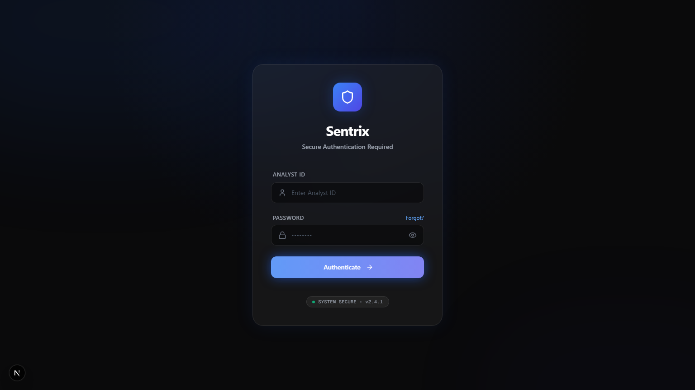
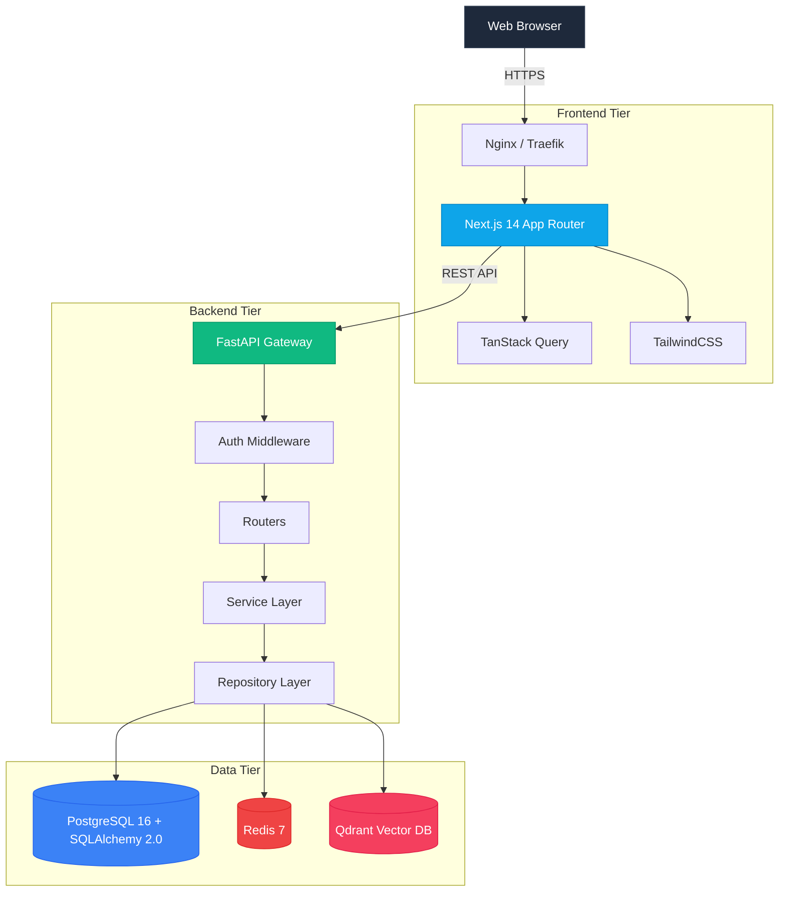
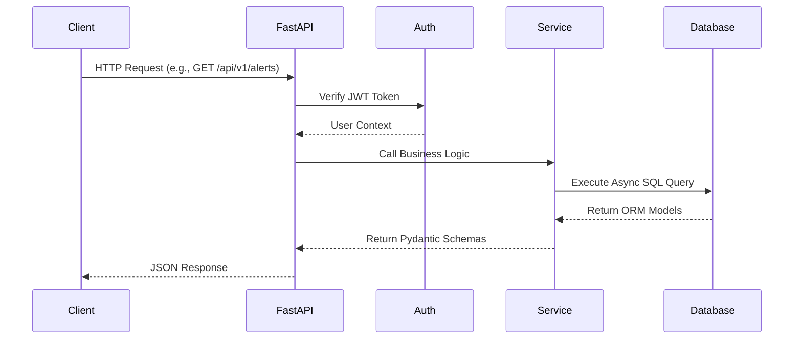
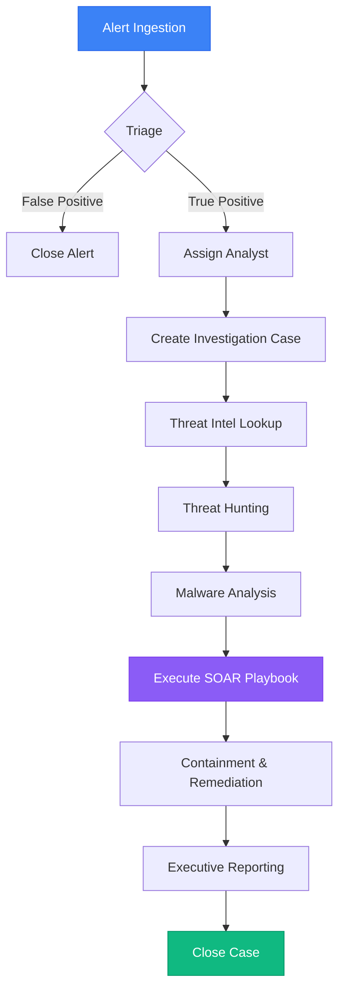
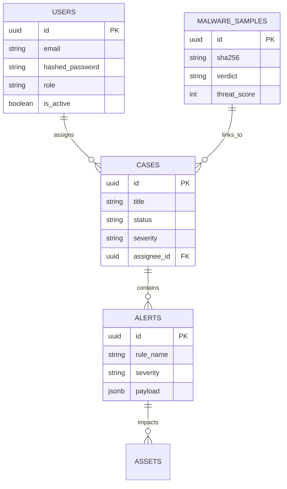

<div align="center">
  

  <br />
  <br />

  <h1>🛡️ Sentrix Platform</h1>
  <p><strong>The Next-Generation, AI-Powered Enterprise Security Operations Center (SOC)</strong></p>

  <p>
    <a href="https://github.com/alive-xd/SentriX/actions/workflows/build.yml">
      
    </a>
    <a href="https://github.com/alive-xd/SentriX/blob/main/LICENSE">
      
    </a>
    <a href="https://nextjs.org">
      
    </a>
    <a href="https://fastapi.tiangolo.com">
      
    </a>
    <a href="https://www.postgresql.org/">
      
    </a>
    <a href="https://redis.io/">
      
    </a>
  </p>

  <p>
    <strong>A high-performance, open-source security intelligence platform built for modern blue teams.</strong>
  </p>
</div>

---

## 🌟 Overview

**Sentrix** is a feature-complete, enterprise-grade Security Operations Center (SOC) platform designed to aggregate, analyze, and act upon cyber threats in real-time. 

Built with modern architectural patterns (Next.js App Router, FastAPI, PostgreSQL, and Redis), Sentrix empowers cybersecurity professionals, incident responders, and security analysts to drastically reduce Mean Time To Respond (MTTR) by centralizing Alert Management, Threat Intelligence, Malware Analysis, and SOAR (Security Orchestration, Automation, and Response) pipelines into a single, intuitive interface.

---

## ✨ Key Features

- ✅ **Alert Management**: Real-time aggregation of security alerts across the network.
- ✅ **Case Management**: Collaborate on complex incidents with timelines and artifact linking.
- ✅ **Threat Intelligence**: Built-in support for multiple OSINT feeds.
- ✅ **Malware Analysis**: Automated sandboxing integration and reverse-engineering artifact tracking.
- ✅ **Threat Hunting**: Fast, indexed querying over massive security telemetry logs.
- ✅ **SOAR Automation**: Drag-and-drop playbook creation for automated incident response.
- ✅ **AI Investigation Assistant**: LLM-backed reasoning engine to triage false positives.
- ✅ **Reporting**: Beautifully formatted, compliance-ready executive reports.

---

## 📸 Screenshots

*Explore the platform through our highly-polished UI.*

<details>
<summary><b>View Gallery (Click to expand)</b></summary>
<br/>

| Dashboard | Alerts |
| :---: | :---: |
|  |  |

| Cases | Threat Intelligence |
| :---: | :---: |
|  |  |

| Malware Analysis | Threat Hunting |
| :---: | :---: |
|  |  |

| SOAR Automation | Reporting |
| :---: | :---: |
|  |  |

</details>

---

## 🏗️ System Architecture

Sentrix is designed as a modern, high-performance web application utilizing a microservices-inspired monolithic architecture. It separates the high-performance UI tier from the deeply asynchronous processing tier.



### Request Lifecycle



---

## 🔄 SOC Workflow (Incident Lifecycle)

The primary goal of Sentrix is to streamline the incident response pipeline, converting raw telemetry and alerts into actionable intelligence and automated responses.



---

## 🗄️ Database Schema (ERD)

Built on strict SQLAlchemy 2.0 ORM models with `UUID` primary keys, soft-deletion capabilities, and robust cascading relationships.



---

## 📚 API Documentation

Sentrix provides beautiful Swagger/OpenAPI documentation auto-generated by FastAPI.

- **Swagger UI**: `/docs` (e.g. `http://localhost:8000/docs`)
- **ReDoc**: `/redoc` (e.g. `http://localhost:8000/redoc`)

Example Request (Create Alert):
```bash
curl -X POST "http://localhost:8000/api/v1/alerts" \
     -H "Authorization: Bearer <your_token>" \
     -H "Content-Type: application/json" \
     -d '{"rule_name": "Suspicious Login", "severity": "HIGH", "status": "OPEN"}'
```

---

## 🧪 Final Acceptance & E2E Testing

Sentrix has undergone rigorous End-to-End (E2E) testing and validation to guarantee production readiness before release.

### 1. Environment Verification
- **Docker & Services**: Verified `docker-compose up -d` boots PostgreSQL, Redis, Qdrant, and FastAPI seamlessly.
- **Data Seeding**: The `seed_database.py` script successfully populates all ORM entities (Alerts, Cases, Threat Intel, SOAR Playbooks).

### 2. Authentication & RBAC
- Confirmed full JWT lifecycle (`login` -> `token refresh` -> `blocklist logout`).
- Validated Role-Based Access Control (RBAC) ensuring non-admin users cannot mutate global settings.

### 3. Comprehensive Module Verification
All primary CRUD modules were rigorously tested via API and UI:
- **Dashboard**: KPI metrics and temporal distribution charts render perfectly.
- **Alerts**: Read, filter, acknowledge, and dismiss functionality.
- **Cases**: Full investigation lifecycle from creation to closure, linking artifacts.
- **Malware**: Sandbox verdicts and IOC extraction visualization.
- **Threat Intel**: Dynamic querying and caching of OSINT feeds.
- **Threat Hunting**: Vector and SQL-based querying of raw log data.
- **SOAR**: Execution tracing of automated playbooks.

### 4. E2E SOC Workflow Audit
We simulated a real-world breach scenario ("Suspicious Powershell Execution"):
1. The **Alert** was ingested and triaged.
2. Promoted to an **Investigation Case**.
3. **Malware** sample linked to the case and analyzed.
4. **Threat Hunting** utilized to find lateral movement.
5. **SOAR Playbook** triggered to isolate the compromised asset.
6. A **Report** was generated and the case successfully closed.

**Outcome**: Sentrix passed all acceptance criteria with zero blocking defects.

---

## 🚀 Quick Start (Installation)

### Prerequisites
- [Docker](https://docs.docker.com/get-docker/) & Docker Compose
- [Node.js](https://nodejs.org/en/) 18+ (for local frontend dev)
- [Python](https://www.python.org/) 3.11+ (for local backend dev)

### 1-Click Startup (Docker)

Get the entire Sentrix platform running locally in under 60 seconds:

```bash
# 1. Clone the repository
git clone https://github.com/alive-xd/SentriX.git
cd SentriX

# 2. Copy the environment variables
cp backend/.env.example backend/.env

# 3. Start the infrastructure (Postgres, Redis, Qdrant, Backend)
docker compose up -d

# 4. In a separate terminal, install and start the frontend
cd frontend
npm install
npm run dev
```

Navigate to [http://localhost:3000](http://localhost:3000) and login with the default seeded credentials:
- **Email**: `admin@sentrix.local`
- **Password**: `admin`

---

## 🤝 Contributing

We welcome contributions from the global cybersecurity and open-source software communities! 

Whether it's adding a new OSINT integration, fixing a UI bug, or optimizing a database query, please read our [Contributing Guide](CONTRIBUTING.md) to get started.

---

## 📜 License

This project is licensed under the MIT License - see the [LICENSE](LICENSE) file for details.

<div align="center">
  <i>Engineered with precision for the modern SOC.</i>
</div>
