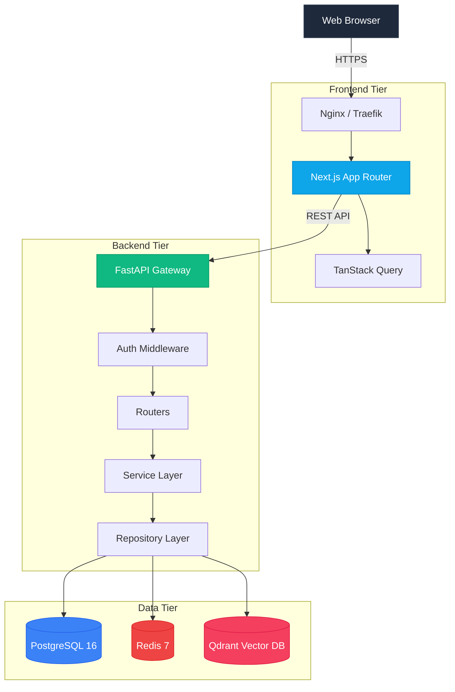
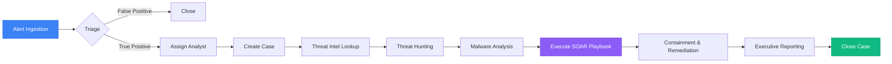
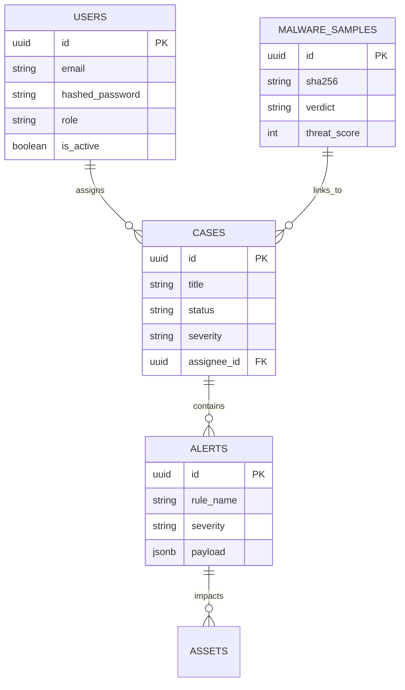

<div align="center">
  

  <br />
  <br />

  <h1>🛡️ Sentrix Platform</h1>
  <p><strong>The Next-Generation, AI-Powered Enterprise Security Operations Center (SOC)</strong></p>

  <p>
    <a href="https://github.com/your-org/sentrix/actions/workflows/build.yml">
      
    </a>
    <a href="https://github.com/your-org/sentrix/blob/main/LICENSE">
      
    </a>
    <a href="https://nextjs.org">
      
    </a>
    <a href="https://fastapi.tiangolo.com">
      
    </a>
    <a href="https://www.python.org/">
      
    </a>
    <a href="https://www.typescriptlang.org/">
      
    </a>
    <a href="https://www.postgresql.org/">
      
    </a>
    <a href="https://redis.io/">
      
    </a>
    <a href="https://qdrant.tech/">
      
    </a>
    <a href="https://www.docker.com/">
      
    </a>
  </p>

  <p>
    <strong>A high-performance, open-source security intelligence platform built for modern blue teams.</strong>
  </p>
</div>

---

## 🌟 Overview

**Sentrix** is a feature-complete, enterprise-grade Security Operations Center (SOC) platform designed to aggregate, analyze, and act upon cyber threats in real-time. 

Built with modern architectural patterns (Next.js App Router, FastAPI, PostgreSQL, and Redis), Sentrix empowers cybersecurity professionals, incident responders, and security analysts to drastically reduce Mean Time To Respond (MTTR) by centralizing Alert Management, Threat Intelligence, Malware Analysis, and SOAR (Security Orchestration, Automation, and Response) pipelines into a single, intuitive interface.

### Why Sentrix?
- **For Enterprise Blue Teams**: Out-of-the-box MITRE ATT&CK mapping, IOC management, and automated playbooks.
- **For Engineering Leaders**: Clean architecture, asynchronous Python services, strict typing, and high test coverage.
- **For Open-Source Contributors**: Extremely easy to run locally (one Docker command) with extensive modularity for adding new threat intelligence feeds.

---

## ✨ Key Features

- ✅ **Alert Management**: Real-time aggregation of security alerts across the network.
- ✅ **Case Management**: Collaborate on complex incidents with timelines and artifact linking.
- ✅ **Threat Intelligence**: Built-in support for multiple OSINT feeds (AlienVault OTX, VirusTotal, etc.).
- ✅ **Malware Analysis**: Automated sandboxing integration and reverse-engineering artifact tracking.
- ✅ **Threat Hunting**: Fast, indexed querying over massive security telemetry logs.
- ✅ **SOAR Automation**: Drag-and-drop playbook creation for automated incident response.
- ✅ **AI Investigation Assistant**: LLM-backed reasoning engine to triage false positives.
- ✅ **Asset Inventory**: Automatically track endpoints, servers, and vulnerability states.
- ✅ **IOC Management**: Global blocklist generation and synchronization.
- ✅ **MITRE ATT&CK Mapping**: Automatic categorization of behaviors into the ATT&CK matrix.
- ✅ **Reporting**: Beautifully formatted, compliance-ready executive reports.
- ✅ **Dashboard Analytics**: Real-time KPI and SOC metrics visualizations.

---

## 📸 Screenshots

*Explore the platform through our highly-polished UI.*

<details>
<summary><b>View Gallery (Click to expand)</b></summary>
<br/>

| Dashboard | Alerts |
| :---: | :---: |
|  |  |

| Alert Details | Cases |
| :---: | :---: |
|  |  |

| Case Details | Threat Intelligence |
| :---: | :---: |
|  |  |

| Threat Hunting | Malware Analysis |
| :---: | :---: |
|  |  |

| SOAR Automation | Reporting |
| :---: | :---: |
|  |  |

| Admin Panel | |
| :---: | :---: |
|  | |

</details>

---

## 🎥 Demo

### Live Demo (Placeholder)
👉 [**Try the Sentrix Live Demo**](https://sentrix.demo.example.com) *(Use admin/admin to login)*

<div align="center">
  
</div>

---

## 🏗️ Architecture

Sentrix implements a microservices-inspired monolithic architecture, separating the high-performance UI tier from the deeply asynchronous processing tier.



For more detailed diagrams, see [docs/architecture.md](docs/architecture.md).

---

## 🔄 SOC Workflow

Sentrix digitizes the complete Incident Response lifecycle.



See [docs/workflow.md](docs/workflow.md) for detailed operational procedures.

---

## 🗄️ Database ERD

Built on strict SQLAlchemy 2.0 ORM models with `UUID` primary keys, soft-deletion capabilities, and robust cascading relationships.



For the complete schema documentation, see [docs/database.md](docs/database.md).

---

## 📚 API Documentation

Sentrix provides beautiful Swagger/OpenAPI documentation auto-generated by FastAPI.

- **Swagger UI**: [http://localhost:8000/docs](http://localhost:8000/docs)
- **ReDoc**: [http://localhost:8000/redoc](http://localhost:8000/redoc)

Example Request (Create Alert):
```bash
curl -X POST "http://localhost:8000/api/v1/alerts" \
     -H "Authorization: Bearer <your_token>" \
     -H "Content-Type: application/json" \
     -d '{"rule_name": "Suspicious Login", "severity": "HIGH", "status": "OPEN"}'
```

See [docs/api.md](docs/api.md) for full module breakdowns.

---

## 🚀 Quick Start (Installation)

### Prerequisites
- [Docker](https://docs.docker.com/get-docker/) & Docker Compose
- [Node.js](https://nodejs.org/en/) 18+ (for local frontend dev)
- [Python](https://www.python.org/) 3.11+ (for local backend dev)

### 1-Click Startup (Docker)

Get the entire Sentrix platform running locally in under 60 seconds:

```bash
# 1. Clone the repository
git clone https://github.com/your-org/sentrix.git
cd sentrix

# 2. Copy the environment variables
cp backend/.env.example backend/.env

# 3. Start the infrastructure (Postgres, Redis, Qdrant, Backend)
docker compose up -d

# 4. In a separate terminal, install and start the frontend
cd frontend
npm install
npm run dev
```

Navigate to [http://localhost:3000](http://localhost:3000) and login with the default seeded credentials:
- **Email**: `admin@sentrix.local`
- **Password**: `admin`

For advanced setup (bare-metal, reverse proxy, scaling), see [docs/deployment.md](docs/deployment.md).

---

## 📂 Folder Structure

```
Sentrix/
├── backend/               # FastAPI backend application
│   ├── app/               # Main application logic (API, Models, Services)
│   ├── alembic/           # Database migrations
│   ├── scripts/           # DB seeding and utility scripts
│   └── tests/             # Backend unit and integration tests
├── frontend/              # Next.js frontend application
│   ├── app/               # Next.js App Router pages
│   ├── components/        # Reusable UI components
│   └── lib/               # Utility functions and API clients
├── docs/                  # Detailed markdown documentation
├── screenshots/           # UI screenshots for README
├── diagrams/              # Mermaid diagram sources
├── assets/                # Logos and banners
├── scripts/               # Global utility scripts
├── docker-compose.yml     # Local orchestration
└── README.md              # You are here
```

---

## 💻 Tech Stack

| Domain | Technology | Description |
| :--- | :--- | :--- |
| **Frontend Framework** | Next.js (App Router) | High-performance React framework. |
| **Styling & UI** | TailwindCSS + Lucide Icons | Utility-first CSS and modern SVGs. |
| **State & Fetching** | TanStack React Query | Advanced caching, deduplication, and polling. |
| **Backend API** | FastAPI (Python 3.11) | Ultra-fast, async Python web framework. |
| **Database (Relational)** | PostgreSQL 16 + SQLAlchemy 2.0 | Primary data store with fully async ORM. |
| **Caching & PubSub** | Redis 7 | JWT blacklisting, rate-limiting, and ephemeral state. |
| **Vector Search (AI)** | Qdrant | Similarity search for Threat Hunting and AI reasoning. |
| **Containerization** | Docker + Docker Compose | Isolated, reproducible deployment environments. |

---

## 🔒 Security

We take platform security as seriously as network security. Sentrix employs:
- **JWT (JSON Web Tokens)**: Secure, short-lived tokens with Redis-backed refresh token rotation and immediate logout blocklisting.
- **Password Hashing**: Industry-standard `bcrypt` hashing via `passlib`.
- **RBAC (Role-Based Access Control)**: Granular permission structures preventing privilege escalation.
- **SQL Injection Protection**: Pure reliance on SQLAlchemy ORM parameterized queries.
- **Input Validation**: Pydantic v2 schemas rigorously sanitize all incoming API payloads.

See [SECURITY.md](SECURITY.md) for our vulnerability disclosure policy and [docs/security.md](docs/security.md) for implementation details.

---

## ⚡ Performance Highlights

- **Asynchronous Execution**: The entire Python stack (`FastAPI` -> `SQLAlchemy` -> `asyncpg` -> `asyncio-redis`) is fully asynchronous, capable of handling thousands of concurrent SIEM logs.
- **Client-Side Caching**: `staleTime` and `refetchInterval` optimizations in React Query prevent redundant dashboard polling.
- **Database Indexing**: Heavy B-Tree indexing on temporal data (Timestamps) and JSONB binary indexing on payload signatures.

---

## 🧪 Testing

Sentrix maintains high code quality through rigorous testing:
- **Backend**: Pytest suite covering all API endpoints and database repositories. Run with `pytest` inside the backend directory.
- **Frontend**: ESLint and TypeScript compilation guarantees type safety.
- **Seed Data**: `python -m scripts.seed_db` populates the environment with robust mock data for immediate manual testing.

---

## 🤝 Contributing

We welcome contributions from the global cybersecurity and open-source software communities! 

Whether it's adding a new OSINT integration, fixing a UI bug, or optimizing a database query, please read our [Contributing Guide](CONTRIBUTING.md) to get started.

---

## 📜 License

This project is licensed under the MIT License - see the [LICENSE](LICENSE) file for details.

<div align="center">
  <i>Engineered with precision for the modern SOC.</i>
</div>
