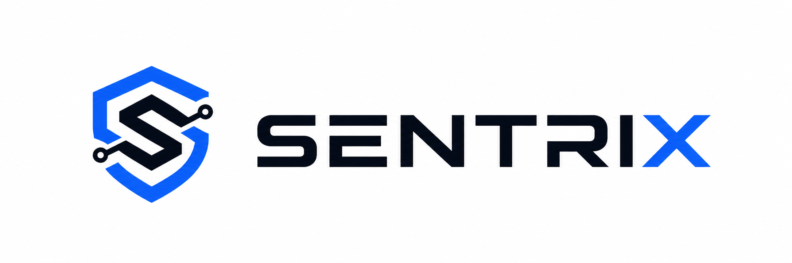
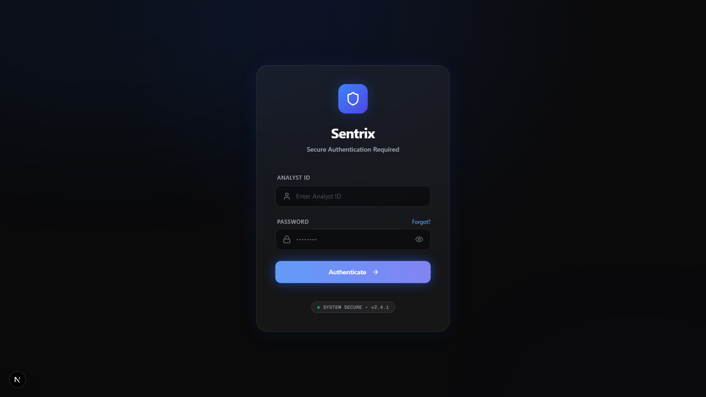
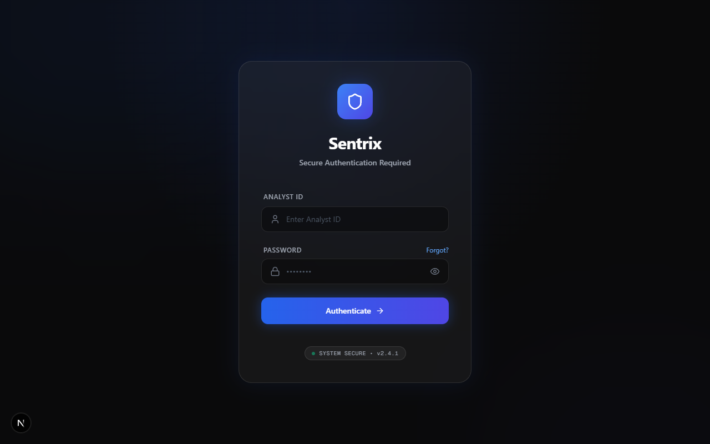
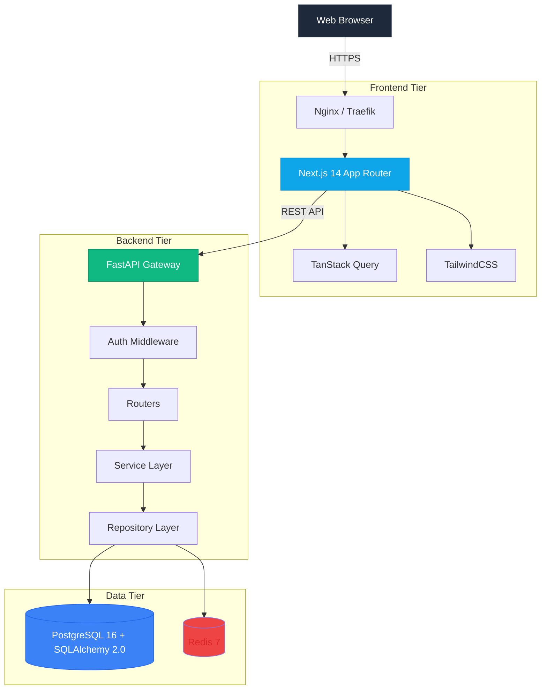
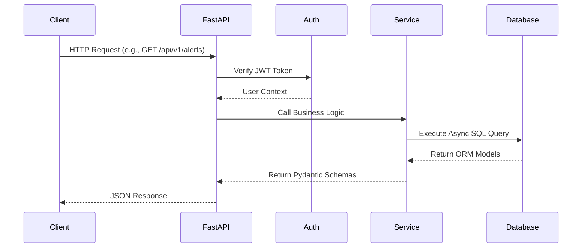
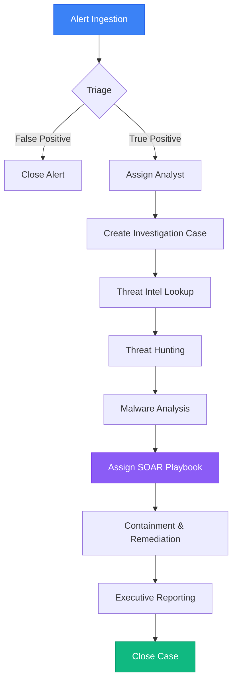
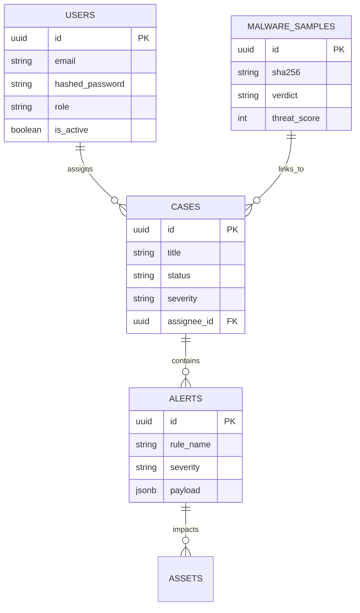

<div align="center">
  

  <br />
  <br />

  <h1>🛡️ Sentrix Platform</h1>
  <p><strong>A Modern Open-Source Security Operations Center (SOC) Workspace</strong></p>

  <p>
    <a href="https://github.com/alive-xd/SentriX/stargazers">
      
    </a>
    <a href="https://github.com/alive-xd/SentriX/network/members">
      
    </a>
    <a href="https://github.com/alive-xd/SentriX/issues">
      
    </a>
  </p>

  <p>
    <a href="https://github.com/alive-xd/SentriX/actions/workflows/build.yml">
      
    </a>
    <a href="https://github.com/alive-xd/SentriX/blob/main/LICENSE">
      
    </a>
    <a href="https://nextjs.org">
      
    </a>
    <a href="https://fastapi.tiangolo.com">
      
    </a>
    <a href="https://www.postgresql.org/">
      
    </a>
    <a href="https://redis.io/">
      
    </a>
  </p>

  <p>
    <strong>Designed using enterprise architecture patterns for modern blue teams.</strong>
  </p>
</div>

---

## 🌟 Overview

**Sentrix** is a modular, service-oriented Security Operations Center (SOC) workspace. 

Built using enterprise architecture patterns (Next.js App Router, FastAPI, PostgreSQL, and Redis), Sentrix provides a robust foundation for building advanced security workflows. It centralizes Alert Management, Threat Intelligence tracking, and Case Collaboration into a single, intuitive interface, providing developers and security teams with a highly extensible platform to build upon.

## 🏢 Use Cases

- **Development Foundation**: Implements a modular service-oriented backend perfect for building custom SOC solutions.
- **Incident Response Tooling**: Quickly deploy Sentrix into an environment using Docker to establish a central tracking workspace.
- **Cyber Range & Education**: Supports seeded datasets for realistic development and demonstrations, training junior analysts on incident response workflows.

## 📊 Project Statistics

| Metric | Verified Count |
| :--- | :--- |
| **Frontend Pages** | 29 |
| **REST API Endpoints** | 81 |
| **Database Tables** | 26 |
| **Backend Services** | 13 |
| **Seeded Alerts** | 485 |
| **Audit Log Entries** | 1000 |

## 🎯 Design Goals

1. **Modern Architecture**: Full asynchronous Python adoption (`asyncio`, `asyncpg`) backed by a strict Repository/Service pattern.
2. **Actionable Context**: Centralized dashboards linking Threat Intel and Malware metadata directly into Cases.
3. **Frictionless Deployment**: Zero complicated Kubernetes manifests required for initial deployment; just pure Docker Compose.
4. **Beautiful UX**: Sentrix leverages TailwindCSS, shadcn/ui, and Framer Motion for a premium dark-mode aesthetic.

---

## ✨ Current Capabilities

### ✅ Fully Implemented
- **Alert Management**: Full CRUD REST APIs and UI for managing security alerts.
- **Case Management**: Collaborate on incidents with dedicated timelines and artifact linking.
- **Authentication**: Stateless JWT lifecycle with Redis-backed refresh token blocklisting.
- **Audit Logging**: Comprehensive internal tracking of user actions.
- **Pagination & Filtering**: Standardized across major data grids.

### ⚠️ Partially Implemented
- **Basic Global Search**: Broad SQL `ILIKE` searches across primary entities.
- **Foundational Role-Based Access Control**: Database models and basic superuser enforcement.
- **Threat Intel IOC Tracking**: Local database management of indicators (IPs, hashes).
- **Malware Sample Management**: Tracking for reverse-engineering artifact metadata.
- **Dashboard**: Aggregate metric displays and recent activity feeds.
- **Organizational Grouping**: Foundational multi-tenant models.

### 🗺️ Planned Roadmap
- **AI Investigation Workspace (Architecture Ready)**: UI is complete; backend currently returns mocked reasoning steps pending LLM integration.
- **SOAR Playbook Management**: Drag-and-drop playbook design UI is complete; execution engine planned.
- **Threat Hunting Workspace**: Query saving exists; advanced telemetry search engine planned.
- **External Integrations**: VirusTotal, AlienVault OTX, and Sandbox API synchronization.
- **Executive Reporting**: Scheduled PDF report generation.

---

## 📸 Screenshots

> Click any image to view full size.

| Dashboard | Alerts |
|-----------|--------|
|  |  |
| Threat metrics with alert severity breakdown and analyst workload distribution | Active alert queue with MITRE ATT&CK technique tagging and one-click case promotion |

| Cases | Threat Intelligence |
|-------|-------------------|
|  |  |
| Full incident timeline with artifact linking, analyst notes, and severity tracking | IOC management and indicator reputation tracking |

| Malware Analysis | Threat Hunting |
|-----------------|----------------|
|  |  |
| Malware artifact tracking with SHA256 tracking and case linkage | Threat hunting query workspace |

| SOAR Automation |
|----------------|
|  |
| Drag-and-drop playbook builder interface |

## 🎥 Demo Walkthrough

[](https://loom.com/REPLACE_WITH_YOUR_LINK)

> Walkthrough — Docker boot → Alert ingestion → Case creation

*Record free at [loom.com](https://loom.com)*

---

## 🏗️ System Architecture

Sentrix is designed as a high-performance web application utilizing a microservices-inspired monolithic architecture.



### Request Lifecycle



---

## 🔄 SOC Investigation Workflow

The primary goal of Sentrix is to streamline the incident response pipeline.



---

## 🛠️ Technology Stack

| Domain | Technology | Description |
| :--- | :--- | :--- |
| **Frontend Framework** | Next.js (App Router) | High-performance React framework. |
| **Styling & UI** | TailwindCSS + Lucide Icons | Utility-first CSS and modern SVGs. |
| **State & Fetching** | TanStack React Query | Advanced caching, deduplication, and polling. |
| **Backend API** | FastAPI (Python 3.11) | Ultra-fast, async Python web framework. |
| **Database (Relational)** | PostgreSQL 16 + SQLAlchemy 2.0 | Primary data store with fully async ORM. |
| **Caching & Auth** | Redis 7 | JWT blacklisting and ephemeral state. |
| **Containerization** | Docker + Docker Compose | Isolated, reproducible deployment environments. |

---

## 📁 Project Structure

```text
SentriX/
├── backend/               # FastAPI backend application
│   ├── app/               # Main application logic (API, Models, Services)
│   ├── alembic/           # Database migrations
│   ├── scripts/           # DB seeding and utility scripts
│   └── tests/             # Backend unit and integration tests
├── frontend/              # Next.js frontend application
│   ├── app/               # Next.js App Router pages
│   ├── components/        # Reusable UI components
│   └── lib/               # Utility functions and API clients
├── screenshots/           # UI screenshots for README
├── assets/                # Logos and banners
├── .github/               # Issue templates and PR guidelines
└── docker-compose.yml     # Local orchestration
```

---

## 🗄️ Database Schema

Built on strict SQLAlchemy 2.0 ORM models with `UUID` primary keys, soft-deletion capabilities, and robust cascading relationships.



---

## 🔌 API Documentation

Sentrix provides beautiful Swagger/OpenAPI documentation auto-generated by FastAPI.

- **Swagger UI**: `/docs` (e.g. `http://localhost:8000/docs`)
- **ReDoc**: `/redoc` (e.g. `http://localhost:8000/redoc`)

Example Request (Create Alert):
```bash
curl -X POST "http://localhost:8000/api/v1/alerts" \
     -H "Authorization: Bearer <your_token>" \
     -H "Content-Type: application/json" \
     -d '{"rule_name": "Suspicious Login", "severity": "HIGH", "status": "OPEN"}'
```

---

## 🚀 Quick Start

### 1-Click Startup (Docker)

Get the entire Sentrix platform running locally:

```bash
# 1. Clone the repository
git clone https://github.com/alive-xd/SentriX.git
cd SentriX

# 2. Copy the environment variables
cp backend/.env.example backend/.env

# 3. Start the infrastructure (Postgres, Redis, Backend)
docker compose up -d

# 4. In a separate terminal, install and start the frontend
cd frontend
npm install
npm run dev
```

Navigate to [http://localhost:3000](http://localhost:3000) and login with the default seeded credentials:
- **Email**: `admin@stark.com`
- **Password**: `password123`

---

## ⚙️ Installation

For bare-metal local installation without Docker:
1. Ensure **PostgreSQL 16** and **Redis 7** are running on your host.
2. Setup a Python 3.11 virtual environment for the backend and install `backend/requirements.txt`.
3. Run migrations via `alembic upgrade head`.
4. Run the backend via `uvicorn app.main:app --host 0.0.0.0 --port 8000 --workers 4`.
5. Build the frontend via `npm run build` and start via `npm run start`.

---

## 🔑 Environment Variables

Crucial environment variables defined in `backend/.env`:

| Variable | Description |
| :--- | :--- |
| `DATABASE_URL` | PostgreSQL Async connection string (`postgresql+asyncpg://`) |
| `REDIS_URL` | Redis connection string (`redis://`) |
| `SECRET_KEY` | 256-bit secret for JWT Signing. **Must be rotated in production.** |

---

## 🌱 Database Seeding

To populate the database with realistic alerts, cases, malware samples, and threat intelligence for testing:

```bash
docker compose exec backend python -m scripts.seed_database
```
This automatically inserts exactly 485 alerts, 120 cases, 300 threat indicators, 150 assets, and 1000 audit logs into the database.

---

## 🔐 Security Features

- **JWT (JSON Web Tokens)**: Secure tokens with Redis-backed refresh token rotation and logout blocklisting.
- **Password Hashing**: Industry-standard `bcrypt` hashing via `passlib`.
- **Foundational Role-Based Access Control**: Database structures preventing privilege escalation.
- **SQL Injection Protection**: Pure reliance on SQLAlchemy ORM parameterized queries.
- **Input Validation**: Pydantic v2 schemas rigorously sanitize all incoming API payloads.

---

## 🛡️ Architecture & Threat Model

- **Trust Boundaries**: The API Gateway (FastAPI) acts as the sole entry point to the data tier. All internal inter-service communication (PostgreSQL, Redis) is assumed secure behind the internal Docker bridge network.
- **Data at Rest**: Sensitive Analyst passwords are cryptographically secured.
- **Data in Transit**: Production deployments should terminate TLS at a Reverse Proxy.

---

## 🧪 Testing

Sentrix has a foundational test suite to ensure API health and basic authentication enforcement.

Run the unit tests locally:
```bash
cd backend
pytest -v
```

---

## 📖 Documentation

The entire platform documentation is self-contained within this README to ensure a single source of truth for all architectural, deployment, and operational procedures. 

---

## ❓ FAQ

**Q: Can I use Sentrix to replace my SIEM?**
A: No, Sentrix is designed as a SOAR and Case Management workspace intended to sit *on top* of a SIEM.

**Q: Is there a paid Enterprise version?**
A: No. Sentrix is 100% open-source under the MIT license.

---

## 🤝 Contributing

We welcome contributions from the global cybersecurity and open-source software communities! 

Please read our [Contributing Guide](CONTRIBUTING.md) to get started with branching rules, PR templates, and issue tracking.

---

## 📅 Changelog

See [CHANGELOG.md](CHANGELOG.md) for detailed version history.

---

## 🙏 Acknowledgements

Special thanks to the open-source projects that made this possible:
- **FastAPI** by Tiangolo
- **Next.js** by Vercel
- **PostgreSQL** community

---

## 📜 License

This project is licensed under the MIT License - see the [LICENSE](LICENSE) file for details.
