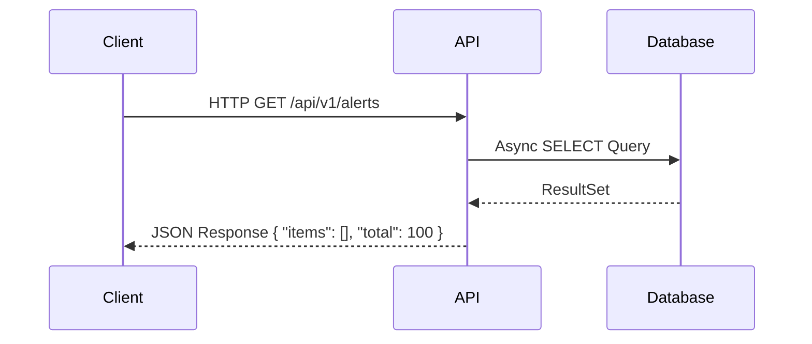

# API Documentation

The Sentrix backend exposes a RESTful API built on FastAPI.

## Interactive Documentation

When running locally, FastAPI automatically generates interactive documentation:
- **Swagger UI**: [http://localhost:8000/docs](http://localhost:8000/docs)
- **ReDoc**: [http://localhost:8000/redoc](http://localhost:8000/redoc)

## API Modules

All endpoints are prefixed with `/api/v1`.

### Authentication
- `POST /auth/login` - OAuth2 login, returns JWT access and refresh tokens.
- `POST /auth/refresh` - Rotate access tokens.
- `POST /auth/logout` - Blacklists current token in Redis.

### Alerts
- `GET /alerts` - Retrieve paginated alerts with filtering.
- `POST /alerts` - Create a new alert.
- `GET /alerts/{id}` - Get alert details.

### Cases
- `GET /cases` - Retrieve paginated cases.
- `POST /cases` - Create an investigation case.
- `GET /cases/{id}` - Get case details.

### Malware
- `GET /malware` - Retrieve malware samples.
- `POST /malware` - Submit a new sample for analysis.
- `GET /malware/{id}` - Get sample analysis results.
- `POST /malware/{id}/block-iocs` - Automate IOC blocking.

## Example Usage

### Authentication
```bash
# Get Token
curl -X POST "http://localhost:8000/api/v1/auth/login" \
     -H "Content-Type: application/x-www-form-urlencoded" \
     -d "username=admin@sentrix.local&password=admin"
```

### Fetching Alerts
```bash
# Get alerts
curl -X GET "http://localhost:8000/api/v1/alerts?skip=0&limit=10" \
     -H "Authorization: Bearer <token>"
```

## Standard API Flow


