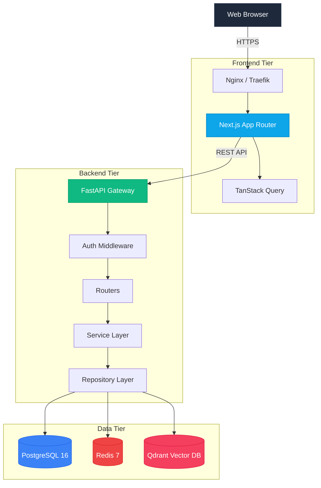
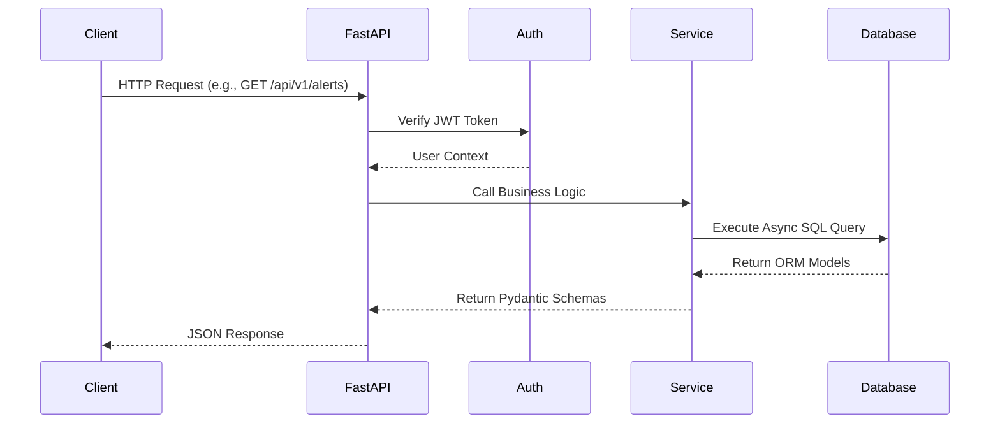

# Sentrix Architecture

Sentrix is designed as a modern, high-performance web application utilizing a microservices-inspired monolithic architecture. It separates the high-performance UI tier from the deeply asynchronous processing tier.

## System Diagram

## Core Components

### 1. Frontend (Next.js)
The frontend uses **Next.js 14+** leveraging the App Router. 
- **Styling**: TailwindCSS provides a utility-first styling approach.
- **State Management**: TanStack React Query handles server state, caching, and background polling.
- **Components**: Modular, reusable React components under `/components/ui`.

### 2. Backend (FastAPI)
The backend is powered by **FastAPI (Python 3.11+)**.
- **Asynchronous**: Fully asynchronous endpoints utilizing `async/await`.
- **Validation**: Strict input validation using Pydantic schemas.
- **Dependency Injection**: Heavy use of FastAPI's dependency injection system for database sessions and authentication.

### 3. Database (PostgreSQL & SQLAlchemy)
- **PostgreSQL 16**: Primary relational database.
- **SQLAlchemy 2.0**: Asynchronous ORM (`asyncpg`).
- **Alembic**: Database schema migrations.

### 4. Caching & Message Broker (Redis)
- **Redis 7**: Used for caching API responses, blacklisting JWT tokens, and rate-limiting.

### 5. AI & Vector Search (Qdrant)
- **Qdrant**: High-performance vector database used for semantic search over threat intelligence and AI reasoning.

## Request Lifecycle

