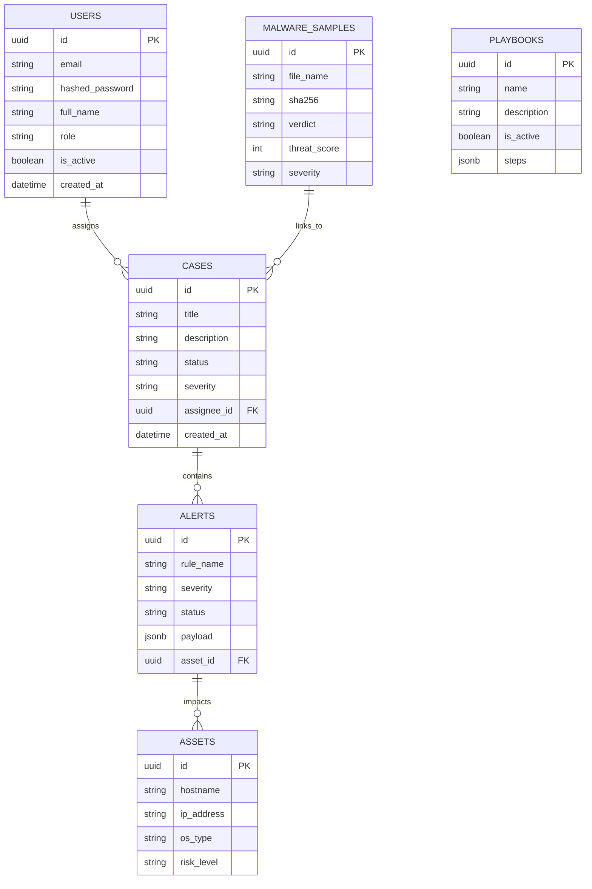

# Database Schema

Sentrix uses PostgreSQL 16 as its primary relational data store, managed via SQLAlchemy 2.0 (async).

## Entity Relationship Diagram (ERD)



## Schema Details

### Base Models
All tables inherit from a declarative base that includes:
- `UUIDMixin`: Uses PostgreSQL UUID generation (`gen_random_uuid()`).
- `TimestampMixin`: Automatically handles `created_at` and `updated_at`.
- `SoftDeleteMixin`: Provides a `deleted_at` column to prevent accidental data destruction.

### Migrations
Database schema changes are tracked using **Alembic**.

To generate a new migration:
```bash
alembic revision --autogenerate -m "added new table"
```

To apply migrations:
```bash
alembic upgrade head
```
