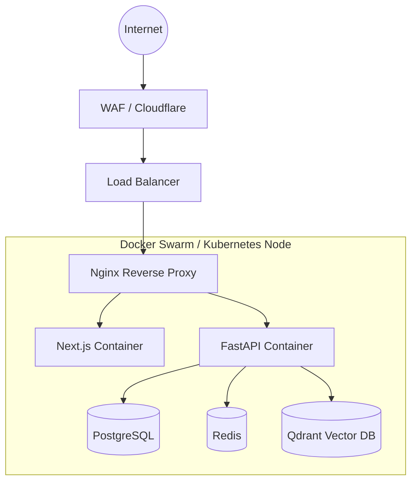

# Deployment Guide

Sentrix is designed to be easily deployable using Docker.

## Production Architecture



## Docker Compose Deployment

The provided `docker-compose.yml` sets up the foundational infrastructure.

### 1. Environment Setup
```bash
cp backend/.env.example backend/.env
# Edit backend/.env with strong passwords
```

### 2. Start Services
```bash
docker compose up -d --build
```

### 3. Database Initialization
Once Postgres is healthy, run Alembic migrations inside the backend container:
```bash
docker compose exec backend alembic upgrade head
```

### 4. Seed Initial Data
```bash
docker compose exec backend python -m scripts.seed_db
```

## Scaling
- **Backend**: Can be horizontally scaled by adjusting workers via Gunicorn/Uvicorn parameters.
- **Postgres**: Recommended to deploy on managed services (AWS RDS, GCP Cloud SQL) for high availability.
- **Redis**: Use ElastiCache or Redis Cluster for production.
