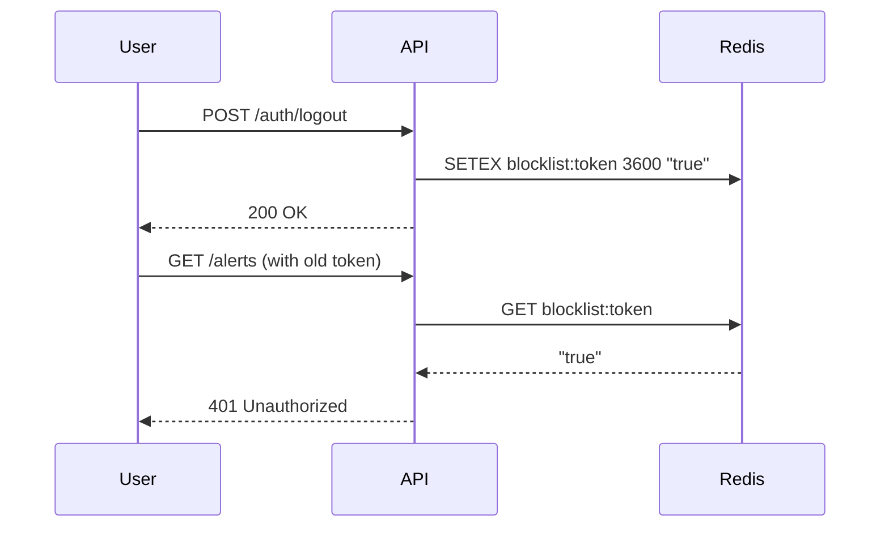

# Security Mechanisms

Security is a first-class citizen in Sentrix. This document outlines the core security features implemented within the platform.

## Authentication (JWT)

Sentrix uses JSON Web Tokens (JWT) for stateless authentication.

1. **Login**: User submits credentials to `/auth/login`.
2. **Validation**: Passwords are hashed and verified using `bcrypt`.
3. **Issuance**: Both `access_token` and `refresh_token` are generated.
4. **Logout**: Refresh tokens are blacklisted in Redis to prevent replay attacks.

## Role-Based Access Control (RBAC)

API routes utilize FastAPI dependencies to verify roles.
Users are assigned roles such as `ADMIN`, `ANALYST`, and `VIEWER`. 

## Data Protection

- **Soft Deletion**: `SoftDeleteMixin` ensures records are marked as `deleted_at` rather than physically removed.
- **SQL Injection**: Prevented by utilizing SQLAlchemy's parameterized queries exclusively.

## Auditing

Key actions in the platform generate immutable Audit Logs (stored in PostgreSQL) ensuring traceability of SOC operations.
