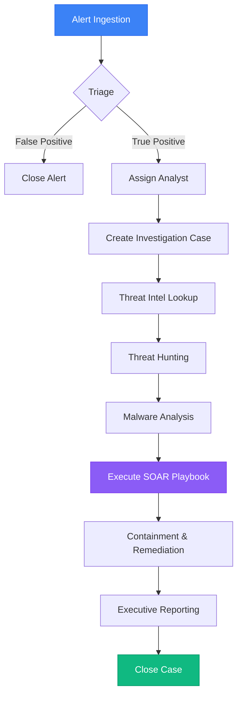

# SOC Workflow

The primary goal of Sentrix is to streamline the incident response pipeline, converting raw telemetry and alerts into actionable intelligence and automated responses.

## Full Incident Lifecycle

### 1. Alert Triage
Security alerts are ingested into the platform via API. Analysts monitor the Dashboard and Alert queue to identify critical incidents. The AI Assistant can be invoked to help determine if an alert is a False Positive.

### 2. Case Management
When a True Positive is identified, it is escalated to a **Case**. Analysts are assigned, and all subsequent investigations (logs, malware samples, IOCs) are linked to this central Case entity.

### 3. Threat Hunting & Intelligence
Analysts query historical logs using the **Threat Hunting** interface and cross-reference findings against global **Threat Intelligence** feeds (OSINT) to enrich the context of the attack.

### 4. Malware Analysis
Suspicious payloads are analyzed in the **Malware** module, extracting Hashes, Registry Modifications, and Network Connections.

### 5. SOAR (Automation)
Analysts trigger **SOAR Playbooks** to automate containment (e.g., "Block IP on Firewall", "Isolate Endpoint").

### 6. Reporting
Once contained, the incident is summarized in the **Reports** module for compliance and executive review.
